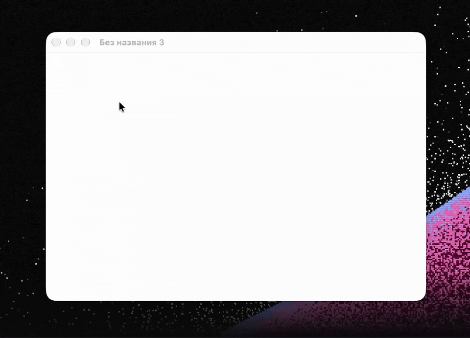

# SmallVoice

[English version](README.md)

SmallVoice - это нативная диктовка для macOS в строке меню. Зажмите клавишу и говорите: текст появится там,
где стоит курсор. Речь распознаётся прямо на Mac моделью
[Parakeet Redux](https://huggingface.co/moondream/parakeet-redux). Это 1.58-битная версия NVIDIA
Parakeet TDT 0.6B v3: 25 языков, включая русский и английский, с пунктуацией и регистром. Ничего не
уходит с компьютера.



## Как пользоваться

| Действие | Что происходит |
|---|---|
| Зажать правый ⌥ и говорить | Идёт запись; отпустили клавишу - текст вставлен (push-to-talk) |
| Коротко нажать правый ⌥ | Запись без рук (в индикаторе появляется замок); повторное нажатие завершает её |
| Esc во время записи | Отмена без вставки |
| ⌥ вместе с другой клавишей | Обычное сочетание клавиш, диктовка не начинается |

- Клавишу можно сменить в настройках: правый ⌘, Fn (🌐) или любое своё сочетание.
- Пока идёт запись и распознавание, внизу экрана видна капсула Liquid Glass: живая волна голоса,
  затем мягкая бегущая волна обработки, затем галочка.
- Текст вставляется через буфер обмена, после чего прежнее содержимое буфера возвращается. "Умный
  пробел" ставит пробел, если вы продолжаете фразу.
- В меню хранятся последние 10 диктовок, по клику текст копируется.
- Длинные диктовки режутся на части до 30 секунд по паузам, которые находит VAD-голова самой модели,
  и распознаются прямо во время записи. Поэтому после отпускания клавиши ждать почти не приходится.

## Требования

- macOS 26 или новее, Apple Silicon.
- Для сборки: Xcode 26 или новее с Metal Toolchain (`xcodebuild -downloadComponent MetalToolchain`)
  и [XcodeGen](https://github.com/yonaskolb/XcodeGen) (`brew install xcodegen`).

## Установка релиза

SmallVoice не подписан сертификатом Apple Developer ID и не нотаризован: у проекта нет платного аккаунта
Apple Developer. Поэтому скачанную копию macOS откроет только после того, как вы один раз это разрешите.

1. Скачайте `SmallVoice.dmg` со страницы Releases, откройте его и перетащите SmallVoice в "Программы".
2. Снимите с приложения карантин загрузки:

   ```bash
   xattr -dr com.apple.quarantine /Applications/SmallVoice.app
   ```

   Без Терминала: откройте SmallVoice, закройте предупреждение и нажмите "Всё равно открыть" в
   Системные настройки -> Конфиденциальность и безопасность.

Без постоянной подписи macOS считает каждую новую версию другим приложением. После обновления снова
разрешите микрофон, а в Системные настройки -> Конфиденциальность и безопасность -> Универсальный
доступ удалите старую запись SmallVoice и включите новую.

## Сборка из исходников

```bash
make install    # Release-сборка в /Applications и запуск
make test       # тесты движка (тестам распознавания нужна скачанная модель)
make build      # Debug-сборка в build/DerivedData
make dmg        # build/SmallVoice.dmg из Release-сборки
```

По умолчанию сборка подписывается ad-hoc, аккаунт разработчика Apple не нужен. Но тогда macOS считает
каждую пересборку новым приложением и снова спрашивает доступ к микрофону и Универсальному доступу.
Чтобы разрешения сохранялись, скопируйте `Config/Local.example.xcconfig` в `Config/Local.xcconfig`
(файл не попадает в git) и укажите там свою команду и bundle ID. Хватит и бесплатного сертификата
Apple Development из Xcode.

## Первый запуск

Окно настройки попросит:

- разрешить доступ к микрофону;
- включить Универсальный доступ (Системные настройки -> Конфиденциальность и безопасность ->
  Универсальный доступ), он нужен для горячей клавиши и вставки текста;
- один раз скачать модель речи (178 МБ).

Модель скачивается с Hugging Face на закреплённой ревизии, проверяется по SHA-256 и хранится в
`~/Library/Application Support/SmallVoice/Models/`.

## Как выпустить релиз

`make dmg` собирает `build/SmallVoice.dmg` из Release-сборки. CI (GitHub Actions, Xcode 26) заодно
запускает юнит-тесты движка и выкладывает этот образ с ad-hoc-подписью как артефакт сборки. Его и
публикуют вместе с инструкцией по установке выше.

С сертификатом Developer ID образ можно было бы подписать и нотаризовать через `scripts/notarize.sh`,
тогда он открывался бы везде без этих шагов:

```bash
xcrun notarytool store-credentials SmallVoice --apple-id you@example.com --team-id ABCDE12345
DEVELOPER_ID="Developer ID Application: Your Name (ABCDE12345)" scripts/notarize.sh
```

## Как устроено

```
Packages/ParakeetKit/   движок распознавания на MLX (Metal GPU), не зависит от приложения
  Weights.swift         тернарные веса без потерь переупаковываются в 2-битную квантизацию MLX
  Features.swift        лог-мел признаки
  Encoder.swift         субсэмплинг, 24 блока FastConformer, VAD-голова
  Decoder.swift         LSTM-предсказатель и жадное TDT-декодирование
  Segmenter.swift       нарезка длинного аудио по паузам
  ParakeetEngine.swift  actor: загрузка, прогрев, распознавание
SmallVoice/                 приложение (SwiftUI и AppKit)
  Dictation/            логика клавиши, запись с микрофона, вставка текста
  Input/                горячие клавиши, разрешения
  Model/                загрузка и проверка модели
  UI/                   индикатор, меню, настройки, окно первого запуска
```

ParakeetKit - это реализация архитектуры Parakeet TDT на Swift (в том виде, как она опубликована в NVIDIA
NeMo и Hugging Face transformers) для тернарного формата весов этой модели. Каждый вес энкодера Parakeet
Redux равен -1, 0 или +1, умноженному на масштаб группы. Это в точности ложится на 2-битную affine-
квантизацию MLX, поэтому веса занимают около 150 МБ и идут через квантизованное умножение матриц MLX.

Во время разработки вывод сверялся с Photon, собственным рантаймом Moondream, и совпадал посимвольно.
Тесты проверяют:

- переупаковку весов бит в бит;
- лог-мел признаки против независимого расчёта на librosa;
- распознавание английских, русских и смешанных длинных записей Common Voice (CC0): против
  произнесённых фраз и против закреплённого эталона.

Скорость на M3 Pro (Release):

| Аудио | Время до текста |
|---|---|
| 5.3 с | 60 мс |
| 8.3 с | 79 мс |
| 41.9 с | 405 мс |

Модель вместе с прогревом загружается примерно за 0.4 с. В простое приложение не тратит CPU и занимает
около 250 МБ памяти, большая часть которой - веса модели.

### Отладочные флаги

```bash
SmallVoice.app/Contents/MacOS/SmallVoice --transcribe a.wav b.m4a   # распознать файлы, показать скорость
open SmallVoice.app --args --hud-demo [recording|hands-free|processing|success|message]
open SmallVoice.app --args --onboarding
```

## Сравнение с другими приложениями

SmallVoice - не единственная бесплатная диктовка для Mac. Выбор сводится к четырём измеримым вещам:
размеру модели на диске, скорости, памяти и точности. Размеры измерены на диске или взяты из документации
проектов, данные о движке - из [карточки модели Parakeet Redux](https://huggingface.co/moondream/parakeet-redux),
а одна строка измерена в этом проекте на M3 Pro.

### Одна и та же Parakeet 0.6B в разных форматах весов

Все приложения на Parakeet ниже запускают одну и ту же сеть. Parakeet Redux, который использует SmallVoice,
хранит каждый вес энкодера как -1, 0 или +1 - отсюда и разница в размере и скорости.

| Реализация | Веса | Real time (секунд аудио в секунду реального времени) |
|---|---|---|
| **Parakeet Redux в SmallVoice (MLX)** | **178 МБ**, 171 МиБ на диске | **88x-105x**, измерено здесь на M3 Pro |
| Parakeet Redux в Photon, собственном рантайме модели | 178 МБ | 38x на CPU, 43x на GPU |
| parakeet.cpp, q8_0 | 0.94 ГБ | 12x на CPU, 38x на GPU |
| parakeet.cpp, f16 | 1.44 ГБ | 9x на CPU, 39x на GPU |
| parakeet-mlx, fp32 | 2.51 ГБ | 37x на GPU |
| Сборки на ONNX Runtime, int8 | 0.67 ГБ | 28x-33x на CPU |
| Parakeet TDT v3 в CoreML, в таком виде его скачивают остальные приложения для Mac | 461 МиБ на диске | не публикуется |

Кроме первой и последней строки данные принадлежат Moondream и измерены на MacBook Air с M2. Исходные веса
этой сети в fp16 занимают 1.2 ГБ.

### Чем меньшие веса платят в точности

WER в процентах, меньше - лучше, из той же карточки модели:

| Бенчмарк | parakeet-tdt-0.6b-v3, 1.2 ГБ | Parakeet Redux, 178 МБ |
|---|---|---|
| Open ASR Leaderboard, 7 английских наборов | **6.26** | 6.55 |
| FLEURS, 25 языков | 11.62 | **10.56** |
| TED-LIUM, 11 полных выступлений | 2.71 | **2.51** |
| Деловая речь (звонки, встречи) | **6.15** | 6.96 |
| Речь с фоновым шумом (MUSAN) | **6.72** | 9.04 |

### Приложения

| Приложение | Модель речи | Языки | Цена | Лицензия | Платформы |
|---|---|---|---|---|---|
| **SmallVoice** | **178 МБ** (171 МиБ на диске) | 25 | бесплатно | MIT | macOS 26+, Apple Silicon |
| [FluidVoice](https://github.com/altic-dev/FluidVoice) | от 250 МБ до 2.9 ГБ, около 500 МБ у Parakeet TDT v3 | 25, или 99 через Whisper | бесплатно | GPL-3.0 | macOS 15+, Apple Silicon |
| [EnviousWispr](https://github.com/saurabhav88/EnviousWispr) | 461 МиБ, или 1.6 ГБ с WhisperKit | 25, или 99 через Whisper | бесплатно | GPL-3.0 | macOS 14+, Apple Silicon |
| [VoiceInk](https://github.com/Beingpax/VoiceInk) | 461 МиБ, или от 75 МБ до 2.9 ГБ с Whisper | 25, или 99 через Whisper | сборка платная, из исходников бесплатно | GPL-3.0 | macOS 15+ |
| [OpenSuperWhisper](https://github.com/Starmel/OpenSuperWhisper) | 461 МиБ, или от 75 МБ до 2.9 ГБ с Whisper | 25, или 99 через Whisper | бесплатно | MIT | macOS, Apple Silicon |
| [Handy](https://github.com/cjpais/Handy) | 731 МБ у Parakeet, или от 487 МБ до 1.6 ГБ с Whisper | 25, или 99 через Whisper | бесплатно | MIT | macOS, Windows, Linux |
| [superwhisper](https://superwhisper.com) | не публикуется, на бесплатном плане только локальный Whisper | 99 | бесплатно, Pro от $8.49 в месяц | проприетарная | macOS, Windows, iOS, Android |
| [MacWhisper](https://www.macwhisper.com/) | не публикуется, в бесплатной версии только небольшие модели Whisper | 99 | бесплатно, Pro от €59 | проприетарная | macOS |
| Диктовка macOS | встроена | системные языки | бесплатно | проприетарная | macOS |

Размеры моделей Whisper - это стандартный набор whisper.cpp; именно Whisper даёт 99 языков ценой от
нескольких сотен мегабайт до нескольких гигабайт и вывода на GPU. Тернарные веса тоже не бесплатны: на
0.29 WER больше, чем у исходной модели на 1.2 ГБ, на семи английских наборах, и заметно больше при шуме,
зато меньше на FLEURS и на длинных выступлениях. В этом приложении они занимают около 150 МБ из примерно
250 МБ, которые оно держит в простое, а диктовка на 5.3 с распознаётся за 60 мс.

Отсутствие лишнего - тоже выбор: в SmallVoice нет ИИ-переписывания, режимов под приложения и облачных
провайдеров, нет сборок для Windows и Linux, и нужен macOS 26. Если это важно, смотрите в сторону
FluidVoice, EnviousWispr и VoiceInk.

## Приватность

Звук записывается только во время диктовки и не сохраняется на диск. Распознавание работает локально.
Единственное обращение к сети - разовая загрузка модели с Hugging Face. Недавние диктовки хранятся
только в памяти и исчезают при выходе.

## Лицензия и благодарности

SmallVoice распространяется по [лицензии MIT](LICENSE).

- Модель речи: [Parakeet Redux](https://huggingface.co/moondream/parakeet-redux) от Moondream на основе
  [NVIDIA Parakeet TDT 0.6B v3](https://huggingface.co/nvidia/parakeet-tdt-0.6b-v3), лицензия
  [CC-BY-4.0](https://creativecommons.org/licenses/by/4.0/). Модели нет в репозитории, приложение
  скачивает её само.
- [mlx-swift](https://github.com/ml-explore/mlx-swift) (MIT), вместе с ним
  [swift-numerics](https://github.com/apple/swift-numerics) и
  [swift-argument-parser](https://github.com/apple/swift-argument-parser) (Apache-2.0).
- [KeyboardShortcuts](https://github.com/sindresorhus/KeyboardShortcuts) (MIT).
- Тестовое аудио: записи [Mozilla Common Voice](https://commonvoice.mozilla.org), CC0 1.0, подробности в
  [Packages/ParakeetKit/Tests/ParakeetKitTests/Fixtures/SOURCES.md](Packages/ParakeetKit/Tests/ParakeetKitTests/Fixtures/SOURCES.md).
